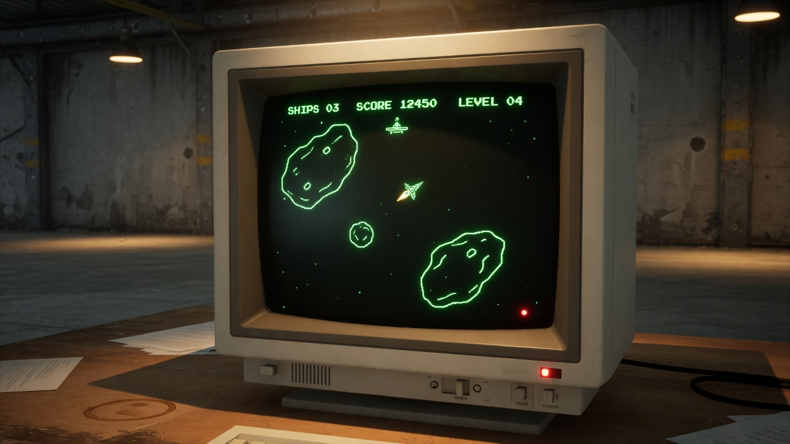

# Asteroids CRT

Classic **Asteroids**-style arcade game in the browser, with a CRT hangar look.



**Play:** open [`index.html`](index.html) in a modern browser (Chrome, Firefox, Edge). Prefer a local server so `game-logic.js` loads (see below).

**Best on desktop keyboard.** No full touch controls (layout still scales on small screens).

Repository: [github.com/JAMAKOCZI/asteroidsCRT](https://github.com/JAMAKOCZI/asteroidsCRT)

---

## Features

- Vector ship with thrust, turn, fire, and **hyperspace** (tap = risky, hold = safe)
- Asteroids that split into smaller pieces (classic point values)
- Levels with rising difficulty; extra ship each level + every 10 000 points
- Combo score multiplier for kill chains
- Large / small / **boss** UFO saucers (boss every 5 levels)
- Power-ups: **S**hield, **R**apid, **T**riple, **W**ide, s**L**ow field
- Optional **Hard** mode from the title screen (`G`)
- **Daily seed** (`D`) and **challenges** (`C`: no hyper / no power / survive 2:00)
- Run **stats** after game over; **ghost** trail of the last run
- **Attract mode** after idle on the title screen
- CRT phosphor palette by level, hangar chrome, Web Audio SFX
- High scores with initials (top 10, separate boards per mode)
- Title screen, pause, mute / volume

---

## Controls

| Key | Action |
|-----|--------|
| **Left / Right** or **A / D** | Turn |
| **Up / W** | Boost / thrust |
| **Space** | Fire (hold for auto-fire with Rapid) |
| **H** or **Down** | Hyperspace — tap risky, hold safe (longer CD) |
| **P** | Pause / resume |
| **A key** (not Tab/modifiers) | Start from title screen |
| **G** / **1** / **2** | Toggle hard / normal / hard (title) |
| **D** | Daily seed mode on/off (title) |
| **C** | Cycle challenge (title) |
| **[** **]** or **,** **.** | Cycle phosphor preview (title) |
| **M** | Mute / unmute |
| **−** **/** **=** | Volume down / up |
| **R** | Restart (after game over) |
| **A–Z**, **Enter** | Enter high-score initials |
| **Esc** | Skip high-score entry |

---

## How to run

### Local file

1. Clone the repo:
   ```bash
   git clone https://github.com/JAMAKOCZI/asteroidsCRT.git
   cd asteroidsCRT
   ```
2. Open `index.html` in your browser (double-click or drag into a window).

> If the browser blocks loading `game-logic.js` from `file://`, use a local server (below). The game falls back to inline helpers if the script is missing.

### Simple local server (recommended)

```bash
# Python 3
python -m http.server 8080
```

Then open [http://localhost:8080](http://localhost:8080).

---

## Tests

Pure gameplay helpers live in [`game-logic.js`](game-logic.js) and are covered by Node’s built-in test runner (no install):

```bash
npm test
# or
node --test test/game-logic.test.js
```

Covers wrap, phosphor cycle, combo mult, high-score eligibility, daily seed stability, spawn delay math, leaderboard sanitization, and more.

---

## Tech

- Browser: `index.html` + `game-logic.js` (HTML / CSS / Canvas 2D / vanilla JS)
- No bundler, no runtime dependencies
- High scores: `localStorage` (classic / daily / challenge keys)
- Logic shared with Node tests via `game-logic.js`

---

## Project status

Full arcade build (phases 1–4): juice/CRT, depth mechanics, meta modes, and quality packaging.  
Roadmap: [`docs/superpowers/specs/2026-07-30-asteroids-four-phase-roadmap.md`](docs/superpowers/specs/2026-07-30-asteroids-four-phase-roadmap.md).

---

## License

See [LICENSE](LICENSE) (MIT).
